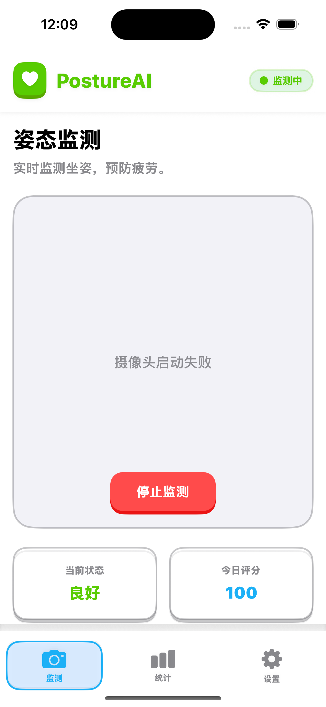
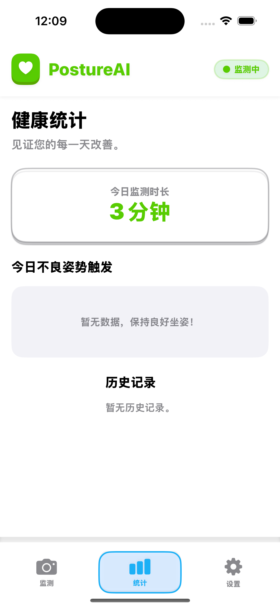
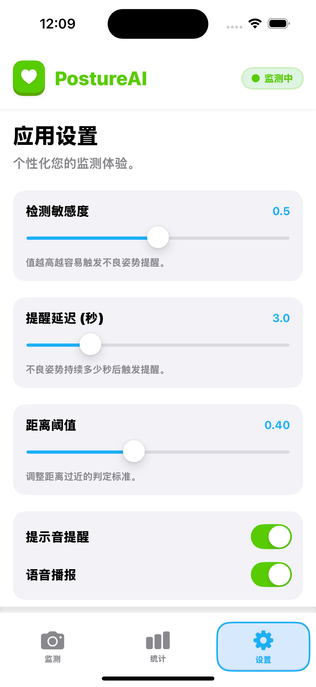
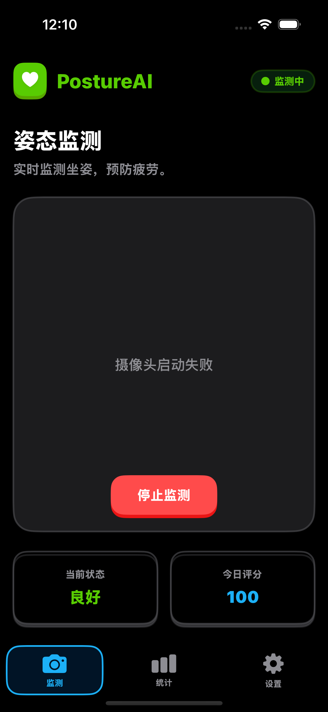
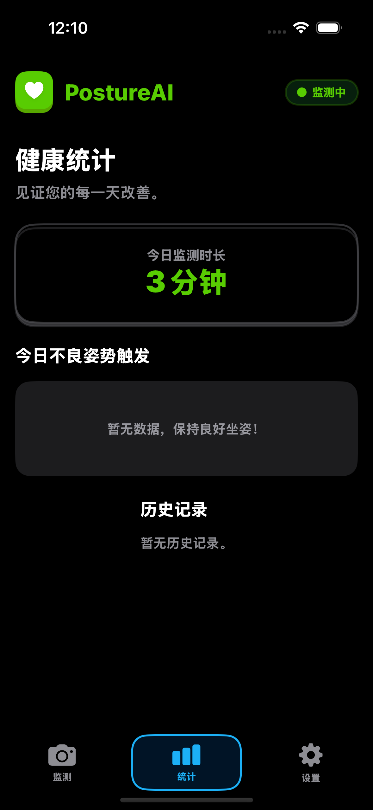
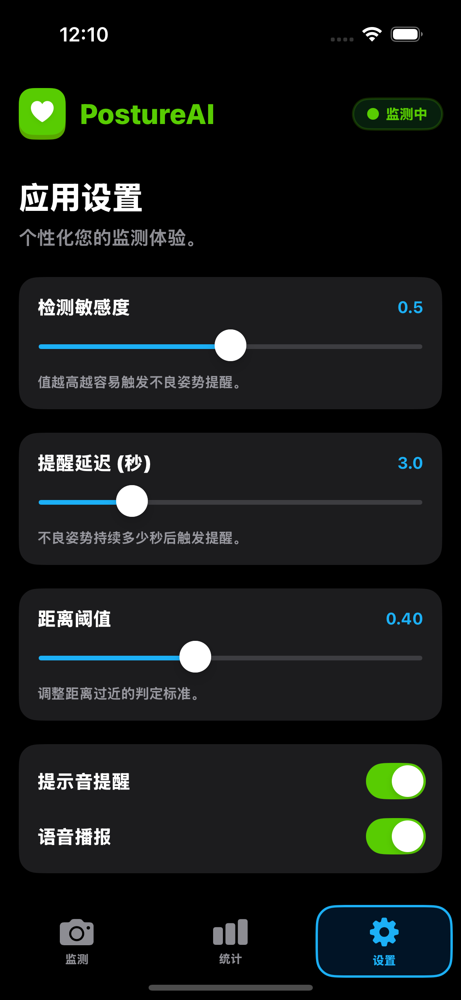

# Posture AI App

## 项目简介
Posture AI App 是一款基于iOS平台的姿势分析应用，使用Swift开发，通过摄像头实时监测用户的姿势并提供反馈，帮助用户保持正确的坐姿，减少因不良姿势导致的健康问题。

## 功能特点
- 实时姿势监测
- 姿势分析与评估
- 历史数据统计与分析
- 个性化设置
- 直观的用户界面

## Screenshots

## 技术栈
- Swift
- SwiftUI
- AVFoundation (相机管理)
- Core ML (姿势分析)

## 项目结构
- `posture-ai-app/` - 主应用代码
  - `Assets.xcassets/` - 应用资源文件
  - `AppViewModel.swift` - 应用视图模型
  - `CameraManager.swift` - 相机管理
  - `CameraPreviewView.swift` - 相机预览视图
  - `ContentView.swift` - 主内容视图
  - `DashboardView.swift` - 仪表盘视图
  - `Models.swift` - 数据模型
  - `MonitorView.swift` - 监测视图
  - `PostureAnalyzer.swift` - 姿势分析器
  - `SettingsView.swift` - 设置视图
  - `posture_ai_app.entitlements` - 应用权限配置
  - `posture_ai_appApp.swift` - 应用入口
- `posture-ai-app.xcodeproj/` - Xcode项目文件

## 安装与运行
1. 克隆项目到本地
2. 使用Xcode打开 `posture-ai-app.xcodeproj` 文件
3. 选择合适的模拟器或连接真机
4. 运行项目

## 使用方法
1. 首次打开应用时，授权相机访问权限
2. 进入监测界面，将摄像头对准自己的上半身
3. 应用会实时分析你的姿势并提供反馈
4. 在仪表盘查看历史姿势数据和分析报告
5. 在设置界面调整应用参数

## 权限说明
- 相机权限：用于实时捕捉用户姿势
- 存储权限：用于保存历史数据

## 贡献指南
欢迎提交问题和 Pull Request 来改进这个项目。

## 许可证
本项目采用 MIT 许可证。